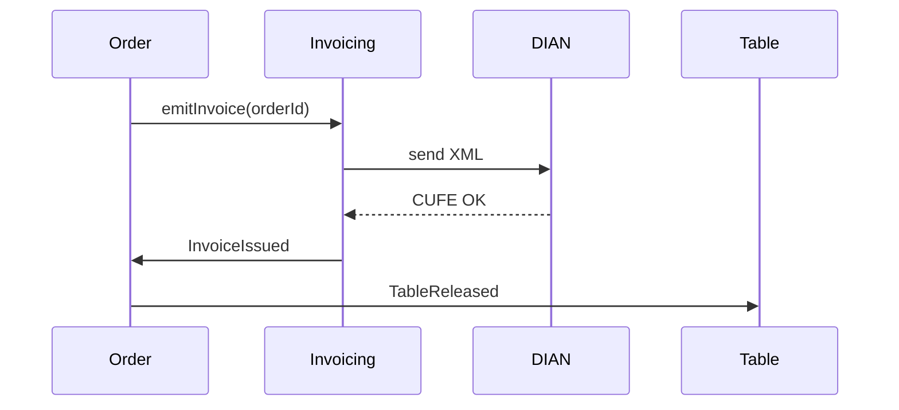

# Flujos que el backend debe cubrir — Inventario POS

> **Propósito:** inventario exhaustivo de los flujos funcionales y de sistema que el backend debe soportar.
> **Audiencia:** dev backend planificando el desarrollo; producto validando cobertura; QA construyendo casos de prueba.
> **Relación con otros docs:**
> - Stack y arquitectura: [`backend-stack-report.md`](./backend-stack-report.md)
> - Cada flujo aquí debe convertirse, en su momento, en una spec OpenAPI/AsyncAPI en `/specs/` del repo backend.
> **Estado:** draft para revisión. Marcar con [x] cuando un flujo tenga spec + tests + implementación.

---

## 0. Convenciones del documento

### 0.1 Formato de cada flujo

```
FL-XXX-NN — Nombre del flujo
- Disparador:    quién/qué inicia (UI / cron / webhook / sync)
- Actor:         rol que lo ejecuta
- Idempotente:   sí/no (importante para offline)
- Pasos:         qué hace el back, en orden
- Endpoint(s):   método + path (sugerido)
- Eventos:       eventos de dominio que emite
- Errores:       casos de error críticos a manejar
```

### 0.2 Convenciones técnicas comunes

| Aspecto | Convención |
|---|---|
| **Versionado** | Prefijo `/v1/` en todas las rutas |
| **Auth** | JWT Bearer. Cada token lleva `tenantId`, `branchId`, `userId`, `roles[]` |
| **Multi-tenant** | RLS en DB. El middleware setea `app.tenant_id` por request |
| **Idempotency** | Header `Idempotency-Key` obligatorio en todo POST/PUT/PATCH mutante |
| **Errores** | RFC 9457 (Problem Details JSON). Códigos estables (`ORDER_NOT_FOUND`, `STOCK_INSUFFICIENT`, etc.) |
| **Paginación** | Cursor-based. `?cursor=<opaque>&limit=50` |
| **Filtros** | `?filter[campo]=valor&sort=-fecha` |
| **Fechas** | ISO 8601 UTC en wire; el cliente convierte a `America/Bogota` |
| **Money** | Enteros en centavos COP (`amountCents`), nunca floats |
| **IDs** | UUID v7 (ordenables por tiempo, útiles para cursor) |
| **Real-time** | WebSocket en `wss://api.../v1/ws`, canales por `tenant:{id}:{topic}` |

### 0.3 Estados de salud

Cada flujo debe documentar su comportamiento bajo:
- **Sin internet** (cliente offline) — solo aplica a POS/Mesero
- **Pasarela caída** — graceful degradation
- **DIAN caído** — emisión queda en cola
- **DB read-replica desfasada** — handling de stale reads

---

## 1. Identity & Tenancy

Onboarding de la empresa, login de usuarios, gestión de sucursales y roles.

### FL-AUTH-01 — Signup de empresa (nuevo tenant)
- **Disparador:** formulario público de registro
- **Actor:** futuro admin del restaurante
- **Idempotente:** sí (por email)
- **Pasos:**
  1. Validar datos empresa (NIT, razón social, ciudad).
  2. Verificar NIT no duplicado.
  3. Crear `tenant`, `branch` por defecto, `user` admin, asignar rol `OWNER`.
  4. Provisionar configuración default (impuestos, moneda, zona horaria).
  5. Crear suscripción trial 30 días.
  6. Emitir evento `TenantCreated`.
  7. Enviar email de verificación.
- **Endpoint:** `POST /v1/public/signup`
- **Eventos:** `TenantCreated`, `UserInvited`
- **Errores:** `NIT_ALREADY_REGISTERED`, `INVALID_NIT_FORMAT`

### FL-AUTH-02 — Login backoffice (email + password)
- **Disparador:** UI `/auth/login.html`
- **Idempotente:** no
- **Pasos:**
  1. Validar credenciales (Argon2id).
  2. Si tiene 2FA: solicitar código TOTP.
  3. Emitir `accessToken` (15min) + `refreshToken` (30d, rotable).
  4. Si pertenece a >1 sucursal: devolver lista para selector.
  5. Registrar evento `UserLoggedIn` (audit).
- **Endpoint:** `POST /v1/auth/login`
- **Errores:** `INVALID_CREDENTIALS`, `USER_LOCKED`, `2FA_REQUIRED`, `2FA_INVALID`

### FL-AUTH-03 — Login PIN (mesero / cajero / POS)
- **Disparador:** UI `mesero/login.html`, `pos/apertura.html`
- **Idempotente:** no
- **Pasos:**
  1. Recibir `branchId` + `pin` (4-6 dígitos).
  2. Buscar `user` con `pin_hash` válido en esa sucursal.
  3. Rate-limit por device fingerprint (5 intentos / 5min).
  4. Emitir tokens con `branchId` y `roles` ya bound.
- **Endpoint:** `POST /v1/auth/pin-login`
- **Errores:** `INVALID_PIN`, `RATE_LIMITED`, `BRANCH_CLOSED`

### FL-AUTH-04 — Refresh de tokens
- **Endpoint:** `POST /v1/auth/refresh`
- Token rotation (el refresh viejo se invalida).
- Detección de reuse → invalidar toda la familia de tokens del usuario.

### FL-AUTH-05 — Recuperación de contraseña
- **Pasos:** generar token único, email con link, expira 1h, single-use.
- **Endpoints:** `POST /v1/auth/forgot`, `POST /v1/auth/reset`

### FL-AUTH-06 — Cambio de contraseña / PIN
- **Endpoint:** `POST /v1/me/password` o `POST /v1/me/pin`
- Requiere password actual.

### FL-AUTH-07 — Activar/desactivar 2FA
- **Endpoints:** `POST /v1/me/2fa/enable`, `POST /v1/me/2fa/verify`, `POST /v1/me/2fa/disable`

### FL-AUTH-08 — Invitar usuario interno
- **Disparador:** `backoffice/usuarios.html`
- **Pasos:** crear `user` pendiente, enviar email con link de activación, asignar roles iniciales.
- **Endpoint:** `POST /v1/users/invite`
- **Eventos:** `UserInvited`

### FL-AUTH-09 — Selector de sucursal
- **Disparador:** `auth/selector-sucursal.html`
- **Endpoint:** `POST /v1/auth/select-branch` → devuelve nuevo token con `branchId`

### FL-AUTH-10 — Gestión de roles y permisos
- **Disparador:** `backoffice/roles.html`
- **Endpoints:** CRUD `/v1/roles`, asignación `POST /v1/users/:id/roles`
- Usar CASL para evaluar abilities en runtime.

### FL-AUTH-11 — Configuración del tenant
- **Disparador:** `backoffice/configuracion.html`
- **Endpoints:** `GET/PATCH /v1/tenant/settings`
- Incluye datos fiscales, logo (S3 presigned upload), zona horaria, moneda, impuestos default.

### FL-AUTH-12 — CRUD sucursales
- **Disparador:** `backoffice/sucursales.html`
- **Endpoints:** `/v1/branches`
- Crear sucursal dispara `BranchCreated` → workers provisionan defaults (estaciones KDS, salones, caja).

---

## 2. Catalog (Catálogo)

Productos, categorías, modificadores, fichas técnicas.

### FL-CAT-01 — CRUD categoría
- **Disparador:** `backoffice/categorias.html`
- **Endpoints:** `/v1/categories`
- Soft delete; preserva ventas históricas.

### FL-CAT-02 — CRUD producto
- **Disparador:** `backoffice/producto.html`
- **Endpoints:** `/v1/products`
- Campos: nombre, descripción, precio (cents), categoría, foto (S3), modificadores, ficha técnica, disponible, sucursales habilitadas.
- Validar precio > 0; nombre único dentro de tenant.
- **Eventos:** `ProductCreated`, `ProductUpdated`, `ProductDisabled`

### FL-CAT-03 — Activar/desactivar producto en sucursal
- **Endpoint:** `POST /v1/products/:id/availability`
- Body: `{ branchId, available: bool, reason }`
- Refleja "sin stock" en POS/Mesero (el front lo pinta como `is-disabled`).
- **Eventos:** `ProductAvailabilityChanged` → invalida cache de catálogo + push WS a POS abiertos.

### FL-CAT-04 — Modificadores
- **Endpoints:** `/v1/modifier-groups`, `/v1/modifiers`
- Modelo: grupos (`Punto de cocción`, `Acompañamientos`) con items (precio delta, multi-select o single).
- Vincular grupos a productos.

### FL-CAT-05 — Fichas técnicas (recetario)
- **Disparador:** `backoffice/fichas.html`
- **Endpoints:** `/v1/recipes`
- Modelo: producto → lista de insumos (cantidad, unidad). Permite costeo y descuento automático de inventario.
- **Eventos:** `RecipeUpdated` → recalcula costos.

### FL-CAT-06 — Catálogo para POS/Mesero (consumo)
- **Endpoint:** `GET /v1/catalog?branchId=...&since=<etag>`
- Optimizado: respuesta cacheada en CDN+Redis, ETag por sucursal.
- Devuelve árbol de categorías + productos disponibles + modificadores.
- Cliente offline lo guarda en IndexedDB y solo descarga deltas.

### FL-CAT-07 — Búsqueda de catálogo
- **Endpoint:** `GET /v1/catalog/search?q=...`
- Postgres FTS con español + accent-insensitive.

---

## 3. Inventory (Inventario)

Insumos, movimientos, conteos, ajustes.

### FL-INV-01 — CRUD insumo
- **Disparador:** `backoffice/inventario.html`
- **Endpoints:** `/v1/items`
- Campos: nombre, unidad base (g/ml/un), stock min/max, costo promedio.

### FL-INV-02 — Movimiento de inventario (entrada por compra)
- **Disparador:** recepción de orden de compra (FL-PROV-03) o entrada manual.
- **Endpoint:** `POST /v1/inventory/movements`
- Body: `{ type: 'IN'|'OUT'|'ADJUST', itemId, qty, unitCost, reason, ref }`
- Recalcula costo promedio ponderado.
- **Eventos:** `InventoryMovementRecorded`

### FL-INV-03 — Conteo físico
- **Disparador:** `backoffice/conteo.html`
- **Pasos:**
  1. Crear conteo en estado `OPEN` con snapshot del stock teórico.
  2. Empleados van capturando conteos por insumo.
  3. Al cerrar: comparar teórico vs real, generar movimientos `ADJUST` por diferencias.
- **Endpoints:** `POST /v1/inventory/counts`, `PATCH /v1/inventory/counts/:id/items`, `POST /v1/inventory/counts/:id/close`
- **Eventos:** `CountStarted`, `CountClosed`

### FL-INV-04 — Descuento automático al vender
- **Trigger:** evento `OrderItemDelivered` → calcular insumos consumidos vía ficha técnica → emitir `InventoryMovementRecorded` (`OUT`).
- **Idempotente:** sí, por `(orderItemId)`.
- **Edge:** si la ficha cambia DESPUÉS de la venta, usar la versión vigente al momento del pedido (snapshot).

### FL-INV-05 — Alertas de stock bajo
- **Disparador:** cron cada hora + después de cada movimiento.
- Si `stockActual < stockMin` → emitir `LowStockAlert` → notificación in-app y email al admin.

### FL-INV-06 — Reporte de rotación
- **Endpoint:** `GET /v1/reports/inventory-turnover?from=...&to=...`
- Lectura desde read-replica.

---

## 4. Suppliers & Purchases (Proveedores y compras)

### FL-PROV-01 — CRUD proveedor
- **Disparador:** `backoffice/proveedores.html`
- **Endpoints:** `/v1/suppliers`

### FL-PROV-02 — Crear orden de compra
- **Endpoint:** `POST /v1/purchase-orders`
- Estados: `DRAFT → SENT → PARTIAL → RECEIVED → PAID`

### FL-PROV-03 — Recepción de mercancía
- **Endpoint:** `POST /v1/purchase-orders/:id/receive`
- Body: `{ items: [{ itemId, qtyReceived, unitCost }] }`
- Genera movimientos `IN` y avanza estado de la PO.
- **Eventos:** `PurchaseReceived`

### FL-PROV-04 — Cuentas por pagar
- **Endpoints:** `/v1/payables` (lectura), `POST /v1/payables/:id/pay` (registrar pago)

---

## 5. Tables (Mesas y salones)

### FL-MESA-01 — Configurar layout
- **Disparador:** `backoffice/mesas.html`
- **Endpoints:** `/v1/floor-plans`, `/v1/tables`
- Cada mesa: nombre, capacidad, salón, posición (x,y) para mapa visual.

### FL-MESA-02 — Asignar mesero a sección
- **Endpoint:** `POST /v1/sections/:id/assign`
- Solo aplica durante turno activo.

### FL-MESA-03 — Abrir mesa
- **Disparador:** mesero toca mesa libre en `mesero/mapa.html`
- **Endpoint:** `POST /v1/tables/:id/open`
- Body: `{ comensales, openedBy, idempotencyKey }`
- Crea aggregate `Order` en estado `OPEN` ligado a la mesa.
- Lock por mesa con TTL — segundo mesero ve mesa ocupada.
- **Eventos:** `TableOpened`, `OrderCreated`

### FL-MESA-04 — Editar comensales
- **Endpoint:** `PATCH /v1/tables/:id` con `{ comensales }`

### FL-MESA-05 — Transferir mesa entre meseros
- **Endpoint:** `POST /v1/tables/:id/transfer`
- Requiere autorización de admin o auto-transferencia con confirmación.
- **Eventos:** `TableTransferred`

### FL-MESA-06 — Unir / dividir mesas
- **Endpoint:** `POST /v1/tables/merge`, `POST /v1/tables/:id/split`
- Mantiene historial — para reportes de ocupación se cuentan como evento atómico.

### FL-MESA-07 — Liberar mesa post-cobro
- **Trigger:** evento `OrderClosed` → si era la única orden de la mesa, marcar mesa como libre.
- Reset de comensales y mesero asignado.

---

## 6. Ordering (Comandas)

Núcleo del sistema. Aplican Event Sourcing y Outbox.

### FL-ORD-01 — Crear comanda
- **Disparador:** abrir mesa (FL-MESA-03) o "venta directa" en POS.
- Generalmente se crea junto con `TableOpened`. POS también puede crear órdenes sin mesa (take-away).

### FL-ORD-02 — Agregar item con modificadores y observación
- **Disparador:** mesero confirma sheet de producto (`mesero/catalogo.html` E6).
- **Endpoint:** `POST /v1/orders/:id/items`
- Body: `{ productId, qty, modifiers: [{groupId, optionIds[]}], observation, idempotencyKey }`
- Snapshot inmutable: nombre, precio, modificadores con sus precios — no debe mutar si el catálogo cambia luego.
- **Eventos:** `OrderItemAdded`

### FL-ORD-03 — Editar observación de item existente
- **Disparador:** botón lápiz en `mesero/detalle.html` (Sprint 12).
- **Endpoint:** `PATCH /v1/orders/:orderId/items/:itemId/observation`
- Solo permite mientras el item NO esté en estado `READY` o posterior.
- **Eventos:** `OrderItemObservationUpdated`

### FL-ORD-04 — Enviar comanda a cocina (push KDS)
- **Disparador:** mesero/POS confirma envío.
- **Endpoint:** `POST /v1/orders/:id/send`
- Body: `{ itemIds[], roundNumber }` (puede enviarse en rondas)
- Lado servidor: marcar items como `SENT`, asignar a estaciones KDS según producto, emitir evento WS.
- **Eventos:** `OrderRoundSent` → fanout a `tenant:{id}:kds:{stationId}`

### FL-ORD-05 — Cancelar item / ronda
- **Endpoint:** `DELETE /v1/orders/:id/items/:itemId` (soft) con `?reason=...`
- Si ya estaba en cocina (`SENT` o posterior) → requiere autorización admin (PIN) y se notifica al KDS.
- **Eventos:** `OrderItemCancelled`

### FL-ORD-06 — Marcar item entregado (mesero)
- **Endpoint:** `POST /v1/orders/:id/items/:itemId/deliver`
- Trigger del descuento de inventario (FL-INV-04).
- **Eventos:** `OrderItemDelivered`

### FL-ORD-07 — Aplicar descuento
- **Endpoint:** `POST /v1/orders/:id/discounts`
- Body: `{ type: 'PERCENT'|'AMOUNT', value, reason, authorizedBy }`
- Requiere PIN de autorización si excede umbral configurado.

### FL-ORD-08 — Mover items entre mesas
- **Endpoint:** `POST /v1/orders/:fromId/transfer-items`
- Body: `{ toOrderId, itemIds[] }`
- Reemite eventos para nueva mesa, original queda con resta.

### FL-ORD-09 — Histórico del turno
- **Endpoint:** `GET /v1/orders?branchId=...&shiftId=...`
- Soporta `mesero/comandas.html` y `pos/historico.html`.

### FL-ORD-10 — Reimprimir comanda
- **Endpoint:** `POST /v1/orders/:id/print`
- Body: `{ printerId, type: 'KDS'|'PRECUENTA'|'COPIA' }`
- Encola job para servicio local de impresión (out-of-scope back, pero el endpoint emite el job).

---

## 7. KDS (Kitchen Display System)

Real-time crítico. WebSocket es el canal principal.

### FL-KDS-01 — Suscripción WS por estación
- **Endpoint:** `wss://api/v1/ws` con subscribe message `{ topic: "kds", stationId: "uuid" }`
- Validar que el `stationId` pertenezca al tenant del token.
- Al conectar: enviar snapshot de comandas activas (no perder estado tras reconexión).

### FL-KDS-02 — Recibir nueva comanda
- Lado cliente recibe `OrderRoundSent` → renderiza tarjeta con timer.
- Lado server: persistir en cola de KDS por estación; permitir replay si KDS se reinicia.

### FL-KDS-03 — Marcar item en preparación
- **Endpoint:** `POST /v1/kds/items/:id/start`
- **Eventos:** `OrderItemPreparing`

### FL-KDS-04 — Marcar item listo
- **Endpoint:** `POST /v1/kds/items/:id/ready`
- **Eventos:** `OrderItemReady` → fanout a `tenant:{id}:waiter:{userId}` (notificación al mesero) + UI de mesa cliente.

### FL-KDS-05 — Recall (devolver item a la cola)
- **Endpoint:** `POST /v1/kds/items/:id/recall`
- Requiere autorización.
- **Eventos:** `OrderItemRecalled`

### FL-KDS-06 — Configurar estaciones
- **Disparador:** `kds/config.html`
- **Endpoints:** CRUD `/v1/kds/stations`
- Mapeo categoría/producto → estación (caliente, frío, bar, postres).

### FL-KDS-07 — Métricas de cocina
- **Endpoint:** `GET /v1/kds/metrics?from=...&to=...`
- Tiempos promedio por estación, items más lentos.

---

## 8. Payments (Cobro)

Saga compleja. Patrón orquestación + outbox + idempotency.

### FL-PAY-01 — Pre-cuenta
- **Disparador:** botón "Pre-cuenta" en `mesero/detalle.html`.
- **Endpoint:** `POST /v1/orders/:id/precheck`
- Genera PDF con resumen (sin valor fiscal) → upload a S3 → emite job de impresión.
- NO cierra la orden ni dispara cobros.

### FL-PAY-02 — Iniciar cobro
- **Disparador:** botón "Cobrar" en POS o mesero (Sprint 6.4).
- **Endpoint:** `POST /v1/orders/:id/payment-intents`
- Body: `{ method: 'CASH'|'CARD_PRESENT'|'LINK'|'MIXED', splits?, idempotencyKey }`
- Crea aggregate `PaymentIntent` con estado `PENDING`. Bloquea ediciones del order.
- **Eventos:** `PaymentIntentCreated`

### FL-PAY-03 — Cobro efectivo
- **Endpoint:** `POST /v1/payments/:intentId/cash`
- Body: `{ receivedCents, changeCents }`
- Marca `PaymentIntent.SETTLED` inmediatamente.
- **Eventos:** `PaymentSettled`

### FL-PAY-04 — Cobro tarjeta presencial (Bold)
- **Endpoint:** `POST /v1/payments/:intentId/bold-terminal`
- Body: `{ terminalId }`
- Server llama API Bold → cliente paga en datáfono → webhook (FL-SYS-30) confirma.
- Estado: `PENDING → PROCESSING → SETTLED|FAILED`.

### FL-PAY-05 — Cobro link de pago (Wompi)
- **Endpoint:** `POST /v1/payments/:intentId/link`
- Genera link Wompi, devuelve URL + QR code (data URL).
- Webhook confirma cuando cliente paga.

### FL-PAY-06 — Cobro mixto
- **Endpoint:** `POST /v1/payments/:intentId/splits`
- Body: `{ splits: [{ method, amountCents }] }`
- `PaymentIntent` se considera `SETTLED` cuando suma de splits = total.

### FL-PAY-07 — Propina
- **Endpoint:** `POST /v1/payments/:intentId/tip`
- Body: `{ amountCents, recipientUserId? }`
- Si `recipientUserId` ausente → propina al pool de meseros del turno (config tenant decide regla).
- **Eventos:** `TipRegistered`

### FL-PAY-08 — Saga de cierre
Cuando `PaymentSettled` se emite:


Si DIAN falla → `InvoicePending` (Saga reintenta vía worker FL-SYS-11) pero la mesa SÍ se libera (no bloquear operación por falla DIAN).

### FL-PAY-09 — Reembolso / anulación
- **Endpoint:** `POST /v1/payments/:id/refund`
- Body: `{ reason, amountCents?, fullRefund: bool }`
- Llama pasarela. Genera nota crédito DIAN (FL-FAC-03).
- Requiere autorización admin.
- **Eventos:** `PaymentRefunded`

### FL-PAY-10 — Ver historial de pagos
- **Endpoint:** `GET /v1/payments?branchId=...&from=...&to=...`

---

## 9. Invoicing (Facturación electrónica DIAN)

Aislada detrás del puerto `IInvoicingProvider`. El adapter habla con The Factory HKA / Facture / etc.

### FL-FAC-01 — Configuración DIAN del tenant
- **Disparador:** `backoffice/facturacion-dian.html`
- **Endpoints:** `GET/PATCH /v1/tenant/dian-config`
- Campos: NIT, razón social fiscal, resolución de facturación (rango), certificado digital (S3 con object-lock + KMS), proveedor PT seleccionado, ambiente (sandbox/prod).

### FL-FAC-02 — Emitir factura electrónica
- **Trigger:** evento `PaymentSettled` (FL-PAY-08) en saga.
- **Pasos:**
  1. Reservar siguiente número de la resolución.
  2. Construir XML UBL 2.1 según spec DIAN.
  3. Firmar con certificado del tenant.
  4. Enviar a PT (con circuit breaker).
  5. Esperar respuesta (CUFE).
  6. Persistir factura + XML + PDF en S3 (object-lock 5 años).
  7. Emitir evento `InvoiceIssued`.
- **Endpoint interno:** `POST /v1/internal/invoices` (no expuesto a UI).
- **Errores:** `DIAN_REJECTED`, `PROVIDER_TIMEOUT` → reintento exponencial (worker FL-SYS-11).

### FL-FAC-03 — Nota crédito (anulación)
- **Trigger:** `FL-PAY-09` reembolso.
- Mismo flujo que FL-FAC-02 con tipo `CREDIT_NOTE` y referencia a factura original.

### FL-FAC-04 — Documento POS equivalente
- Para clientes sin requerimiento de factura electrónica (ventas < umbral).
- Genera PDF simple, sin DIAN.

### FL-FAC-05 — Reintento por falla
- Worker FL-SYS-11 procesa cola `dian-retry` con backoff exponencial.
- Después de N reintentos → alerta admin.

### FL-FAC-06 — Consulta estado
- **Endpoint:** `GET /v1/invoices/:id/status`
- Útil para UI mostrar `PENDING / ISSUED / REJECTED`.

### FL-FAC-07 — Envío al cliente
- **Endpoint:** `POST /v1/invoices/:id/send`
- Body: `{ email, channel: 'EMAIL'|'WHATSAPP' }`
- Worker SES o Twilio.

### FL-FAC-08 — Reporte mensual DIAN
- Cron mensual genera CSV con totales para presentación.

---

## 10. Customers (Clientes)

### FL-CLI-01 — Crear cliente
- **Disparador:** caja en momento de cobro o storefront en signup.
- **Endpoint:** `POST /v1/customers`
- Validar NIT/CC unicidad por tenant.

### FL-CLI-02 — Asociar a comanda
- **Endpoint:** `POST /v1/orders/:id/customer`

### FL-CLI-03 — Historial de consumo
- **Endpoint:** `GET /v1/customers/:id/orders`

### FL-CLI-04 — Programa de fidelización (futuro)
- Deferred a fase 4. Modelo: puntos por compra, redención.

---

## 11. Cash Management (Caja)

### FL-CAJA-01 — Apertura de turno
- **Disparador:** `pos/apertura.html`
- **Endpoint:** `POST /v1/shifts`
- Body: `{ branchId, openingCashCents, notes }`
- Crea `Shift` activo. Solo puede haber uno por caja simultáneamente.
- **Eventos:** `ShiftOpened`

### FL-CAJA-02 — Movimientos de caja
- **Endpoint:** `POST /v1/shifts/:id/cash-movements`
- Body: `{ type: 'IN'|'OUT', amountCents, reason, ref? }`
- Para retiros parciales, fondo de caja, etc.

### FL-CAJA-03 — Arqueo intermedio
- **Endpoint:** `POST /v1/shifts/:id/intermediate-count`
- Solo lectura del estado actual + registro auditable.

### FL-CAJA-04 — Cierre de turno
- **Endpoint:** `POST /v1/shifts/:id/close`
- Body: `{ countedCashCents, notes }`
- Compara teórico vs real → genera diferencia.
- Genera reporte Z (PDF en S3).
- **Eventos:** `ShiftClosed`

### FL-CAJA-05 — Diferencias y autorizaciones
- Si diferencia > umbral configurado → requiere PIN de autorización al cerrar.

---

## 12. Expenses (Gastos)

### FL-GAS-01 — Registrar gasto
- **Disparador:** `backoffice/gastos.html`
- **Endpoint:** `POST /v1/expenses`
- Body: `{ categoryId, amountCents, supplier?, description, date, attachmentUrl? }`

### FL-GAS-02 — Adjuntar soporte
- Presigned upload a S3 → URL persistida en gasto.

### FL-GAS-03 — Categorización contable
- Categorías de gasto → mapeo a cuenta contable PUC Colombia.

---

## 13. Accounting (Contabilidad)

### FL-CONT-01 — Asientos automáticos
- Trigger eventos: `PaymentSettled`, `ExpenseRegistered`, `InvoiceIssued`, `RefundProcessed`.
- Worker proyecta a tabla `journal_entries`.

### FL-CONT-02 — Export contable
- **Endpoint:** `GET /v1/accounting/export?format=siigo|world-office&from=...&to=...`
- Devuelve archivo descargable.

### FL-CONT-03 — Conciliación bancaria
- Future. Importar extracto banco → matching con ventas y gastos.

---

## 14. Reporting / Dashboard

Lectura desde read-replica + cache Redis.

### FL-REP-01 — Dashboard backoffice
- **Disparador:** `backoffice/dashboard.html`
- **Endpoint:** `GET /v1/reports/dashboard?period=today|week|month`
- Devuelve: ventas totales, ticket promedio, top productos, ocupación promedio.
- Cache 60s.

### FL-REP-02 — Top productos
- **Endpoint:** `GET /v1/reports/top-products?from=...&to=...&limit=10`

### FL-REP-03 — Ranking meseros
- **Endpoint:** `GET /v1/reports/staff-performance?from=...&to=...`

### FL-REP-04 — Ocupación mesas
- **Endpoint:** `GET /v1/reports/table-occupancy?date=...`
- Agregación por hora.

### FL-REP-05 — Reportes X / Z
- **Endpoint:** `GET /v1/shifts/:id/x-report` (intermedio, no cierra)
- **Endpoint:** `GET /v1/shifts/:id/z-report` (post-cierre, fiscal)

### FL-REP-06 — Export
- Cada reporte acepta `?format=pdf|csv|xlsx`.
- Async para datasets grandes: encola job → email link cuando listo.

---

## 15. Storefront (cliente final, QR)

Pantallas en `/storefront/`. Auth aparte (clientes finales).

### FL-STORE-01 — Acceso vía QR
- URL: `https://app.../v1/store/:branchId/:tableId?token=...`
- Sin auth si el QR es estático; con OTP si el restaurante exige identificación.

### FL-STORE-02 — Login OTP cliente
- **Endpoint:** `POST /v1/store/auth/request-otp`
- **Endpoint:** `POST /v1/store/auth/verify-otp`

### FL-STORE-03 — Crear pedido cliente
- **Endpoint:** `POST /v1/store/orders`
- Lo asocia a la mesa del QR. Cae en la misma cola de KDS que pedidos del mesero.
- Notificación al mesero asignado.

### FL-STORE-04 — Pago online
- **Endpoint:** `POST /v1/store/orders/:id/pay`
- Crea PaymentIntent tipo `LINK` (Wompi).

### FL-STORE-05 — Tracking de estado
- **Endpoint:** `GET /v1/store/orders/:id/status`
- Server-Sent Events o polling cada 5s.

### FL-STORE-06 — Llamar mesero / pedir cuenta
- **Endpoint:** `POST /v1/store/tables/:id/call-waiter`
- **Endpoint:** `POST /v1/store/tables/:id/request-bill`
- Notificación push al mesero asignado.

---

## 16. Integrations (Configuración de terceros)

### FL-INT-01 — Configurar pasarela
- **Disparador:** `backoffice/integraciones.html`
- **Endpoints:** `POST /v1/integrations/payment-gateways`
- Credenciales encriptadas (KMS) en Secrets Manager, referencia en DB.

### FL-INT-02 — Configurar PT DIAN
- Ya cubierto en FL-FAC-01.

### FL-INT-03 — Configurar impresoras
- **Endpoint:** `/v1/integrations/printers`
- IP, puerto, tipo (térmica 80mm), estación KDS asociada.

### FL-INT-04 — API keys para terceros
- **Endpoint:** `POST /v1/api-keys`
- Devuelve key una sola vez (no recuperable).
- Scopes granulares.

### FL-INT-05 — Webhooks salientes
- **Endpoint:** `POST /v1/webhooks`
- Tenant puede suscribirse a eventos (ej. integrar con su sistema contable).
- Firmados con HMAC.

---

# Flujos de sistema (no user-facing)

## A. Sincronización offline (POS / Mesero)

### FL-SYS-01 — Bootstrap inicial del cliente
- **Disparador:** primer login del device (o reset).
- **Endpoint:** `GET /v1/sync/snapshot`
- Devuelve todo lo necesario para operar offline: catálogo, mesas, configuración, sesión actual.
- Guardar `serverVersion` (ULID).

### FL-SYS-02 — Push de mutaciones encoladas
- **Endpoint:** `POST /v1/sync/push`
- Body: `{ mutations: [{ clientOpId, idempotencyKey, type, payload, clientTimestamp }] }`
- Procesado server: por cada mutación, ejecutar como request normal con su idempotency-key.
- Devuelve resultados por mutación (`OK`, `CONFLICT`, `REJECTED`).

### FL-SYS-03 — Pull de cambios
- **Endpoint:** `GET /v1/sync/pull?since=<serverVersion>`
- Devuelve todos los eventos de dominio del tenant relevantes para esta sucursal desde `serverVersion`.

### FL-SYS-04 — Resolución de conflictos
- **Stock:** server-authoritative. Cliente recibe `STOCK_INSUFFICIENT` → mostrar al mesero, opciones de sustitución.
- **Mesa abierta:** lock por mesa. Segundo mesero offline que abrió misma mesa recibe `TABLE_ALREADY_OPEN` → su orden offline se convierte en orden separada (take-away) o se descarta con confirmación del usuario.
- **Cancelación de item ya entregado:** rechazar.

### FL-SYS-05 — Heartbeat / detección de offline prolongado
- Cliente envía `POST /v1/sync/heartbeat` cada 30s mientras online.
- Si server no recibe heartbeat de un device por > 4h → marcar `device_status = STALE` (visible en backoffice para debug).

## B. Workers asíncronos (consumen colas SQS / EventBridge)

### FL-SYS-10 — Outbox poller
- Lee tabla `outbox` cada 1s, publica eventos pendientes a EventBridge.
- Marca `published_at`.
- Reintento con backoff si EventBridge falla.

### FL-SYS-11 — Worker DIAN
- Consume cola `dian-pending`.
- Llama PT con circuit breaker.
- Reintentos: 1m, 5m, 30m, 2h, 12h.
- Después de 5 fallos → DLQ + alerta admin.

### FL-SYS-12 — Worker emails facturas
- Consume `email-pending`.
- Renderiza template, envía vía SES.

### FL-SYS-13 — Worker SMS / push
- Consume `notification-pending`.
- Twilio para SMS, SNS para push.

### FL-SYS-14 — Conciliador de pagos
- Cron cada 15min.
- Compara webhooks recibidos vs `PaymentIntent` en estado `PROCESSING > 30min`.
- Si pasarela confirma pago pero no llegó webhook → reconcilia.
- Si pasarela dice failed pero `PaymentIntent` sigue PROCESSING → marca FAILED.

## C. Cron jobs

### FL-SYS-20 — Cierre Z automático
- Diario 02:00 hora local del tenant.
- Si quedó turno abierto > 12h → cierre forzado con marca de auditoría.

### FL-SYS-21 — Reporte diario por email
- Diario 08:00 al admin: ventas día anterior, top productos, alertas.

### FL-SYS-22 — Backup
- PITR continuo en Aurora + snapshot diario a S3 cross-region.

### FL-SYS-23 — Limpieza de datos efímeros
- Idempotency keys vencidas (>24h).
- Magic links/OTPs vencidos.
- WS connection records de DynamoDB sin actividad >1h.

### FL-SYS-24 — Refresh de certificados
- Mensual: chequear vencimiento del certificado digital DIAN. Alerta 30 días antes.

### FL-SYS-25 — Recompute de costos
- Nocturno: recalcular costo promedio ponderado de insumos.

## D. Webhooks entrantes

### FL-SYS-30 — Webhook pasarela (Wompi / Bold / PayU / MP)
- **Endpoint:** `POST /v1/webhooks/{provider}`
- Validar firma HMAC.
- Parsear payload normalizado por adapter.
- Idempotente por `eventId` de la pasarela.
- Avanza estado del `PaymentIntent` correspondiente.
- Responder 200 rápido (procesar en queue si es pesado).

### FL-SYS-31 — Webhook DIAN (PT)
- Algunos PT envían cambios de estado async.
- Mismo patrón que pasarelas.

---

## Apéndice A — Matriz flujos por superficie del front

Mapeo rápido para saber qué flujos toca cada pantalla del front.

| Pantalla front | Flujos backend involucrados |
|---|---|
| `auth/login.html` | FL-AUTH-02, FL-AUTH-04 |
| `auth/login-pin.html` | FL-AUTH-03 |
| `auth/recovery.html` | FL-AUTH-05 |
| `auth/selector-sucursal.html` | FL-AUTH-09 |
| `backoffice/dashboard.html` | FL-REP-01, FL-REP-02, FL-REP-03 |
| `backoffice/usuarios.html` | FL-AUTH-08, FL-AUTH-10 |
| `backoffice/sucursales.html` | FL-AUTH-12 |
| `backoffice/roles.html` | FL-AUTH-10 |
| `backoffice/configuracion.html` | FL-AUTH-11 |
| `backoffice/integraciones.html` | FL-INT-* |
| `backoffice/facturacion-dian.html` | FL-FAC-01, FL-FAC-08 |
| `backoffice/categorias.html` | FL-CAT-01 |
| `backoffice/catalogo.html` | FL-CAT-02 a 04 |
| `backoffice/producto.html` | FL-CAT-02 a 05 |
| `backoffice/fichas.html` | FL-CAT-05 |
| `backoffice/inventario.html` | FL-INV-01, FL-INV-02, FL-INV-05 |
| `backoffice/conteo.html` | FL-INV-03 |
| `backoffice/proveedores.html` | FL-PROV-* |
| `backoffice/clientes.html` | FL-CLI-* |
| `backoffice/mesas.html` | FL-MESA-01 |
| `backoffice/caja.html` | FL-CAJA-* |
| `backoffice/gastos.html` | FL-GAS-* |
| `backoffice/contabilidad.html` | FL-CONT-* |
| `backoffice/reportes.html` | FL-REP-* |
| `pos/apertura.html` | FL-AUTH-03, FL-CAJA-01 |
| `pos/mapa.html` | FL-MESA-* |
| `pos/pedido.html` | FL-ORD-*, FL-CAT-06 |
| `pos/cobro.html` (modal) | FL-PAY-*, FL-FAC-02 |
| `pos/historico.html` | FL-ORD-09 |
| `mesero/login.html` | FL-AUTH-03 |
| `mesero/sala.html` | FL-MESA-* |
| `mesero/mapa.html` | FL-MESA-* |
| `mesero/detalle.html` | FL-ORD-*, FL-PAY-01 |
| `mesero/catalogo.html` | FL-CAT-06, FL-ORD-02 |
| `mesero/cobro.html` | FL-PAY-*, FL-FAC-02 |
| `mesero/comandas.html` | FL-ORD-09 |
| `mesero/perfil.html` | FL-AUTH-06 |
| `kds/main.html` | FL-KDS-01 a 05 |
| `kds/config.html` | FL-KDS-06 |
| `storefront/*` | FL-STORE-* |

---

## Apéndice B — Eventos de dominio (catálogo)

Lista de todos los eventos publicados al bus. Cada uno se documenta en AsyncAPI.

| Evento | Publicado por | Consumidores principales |
|---|---|---|
| `TenantCreated` | FL-AUTH-01 | onboarding worker, billing |
| `UserInvited` | FL-AUTH-08 | email worker |
| `UserLoggedIn` | FL-AUTH-02/03 | audit log |
| `BranchCreated` | FL-AUTH-12 | provisioning worker |
| `ProductCreated/Updated/Disabled` | FL-CAT-* | cache invalidator, KDS routing |
| `ProductAvailabilityChanged` | FL-CAT-03 | cache invalidator, push WS |
| `RecipeUpdated` | FL-CAT-05 | cost recompute |
| `InventoryMovementRecorded` | FL-INV-* | reporting, low stock alert |
| `LowStockAlert` | FL-INV-05 | notificación |
| `CountStarted/Closed` | FL-INV-03 | reporting |
| `PurchaseReceived` | FL-PROV-03 | inventory worker |
| `TableOpened/Transferred/Released` | FL-MESA-* | reporting, mesero notif |
| `OrderCreated` | FL-ORD-01 | KDS |
| `OrderItemAdded` | FL-ORD-02 | KDS, total recompute |
| `OrderItemObservationUpdated` | FL-ORD-03 | KDS push |
| `OrderRoundSent` | FL-ORD-04 | KDS fanout |
| `OrderItemCancelled` | FL-ORD-05 | KDS, audit |
| `OrderItemPreparing/Ready` | FL-KDS-03/04 | mesero notif, métricas |
| `OrderItemDelivered` | FL-ORD-06 | inventory descuento |
| `OrderItemRecalled` | FL-KDS-05 | KDS |
| `PaymentIntentCreated` | FL-PAY-02 | saga |
| `PaymentSettled` | FL-PAY-03/04/05/06 | invoicing saga, accounting |
| `PaymentRefunded` | FL-PAY-09 | invoicing, accounting |
| `TipRegistered` | FL-PAY-07 | reporting, payroll |
| `InvoiceIssued` | FL-FAC-02 | email, accounting |
| `InvoiceFailed` | FL-FAC-05 | retry worker, alert |
| `ShiftOpened/Closed` | FL-CAJA-* | reporting, accounting |
| `ExpenseRegistered` | FL-GAS-01 | accounting |

---

## Apéndice C — Riesgos transversales por flujo

| Riesgo | Flujos afectados | Mitigación |
|---|---|---|
| Doble cobro por reintento de red | FL-PAY-* | Idempotency keys obligatorios |
| Comanda perdida al desconectarse mesero | FL-ORD-*, FL-SYS-02 | Cola local + push al reconectar |
| Item enviado a estación KDS equivocada | FL-KDS-02 | Mapeo categoría→estación versionado |
| Stock negativo por concurrencia | FL-INV-04 | Optimistic lock + check en transacción |
| Factura duplicada en DIAN | FL-FAC-02 | Idempotency por `orderId` + lock en reserva de número |
| Mesa "fantasma" (abierta pero olvidada) | FL-MESA-03 | Cron auto-close si turno cierra |
| Catálogo cacheado obsoleto | FL-CAT-06 | ETag + invalidación en eventos |
| Pago confirmado por webhook pero nunca recibido | FL-SYS-30 | Conciliador FL-SYS-14 |

---

## Próximos pasos

1. **Validar** este inventario con producto y mesa de operaciones (¿algún flujo del día a día del restaurante que no esté?).
2. **Priorizar** flujos por fase del roadmap (ver `backend-stack-report.md` §10).
3. **Convertir cada flujo** en un issue/ticket con su spec OpenAPI cuando entre a sprint.
4. **Trazabilidad:** mantener este `.md` como índice; cuando un flujo se implementa, linkear a su spec y al PR.

*Documento vivo. Si agregás un flujo nuevo en el front, agregalo acá primero.*
