# Diagramas de flujo — por rol de usuario

> Diagramas Mermaid de los flujos de la app. GitHub los renderiza nativo en markdown.
> Para la descripción narrativa, ver [`flujos.md`](./flujos.md).

---

## 1. Cliente / Comensal — Storefront

### 1.1 Tienda online (compra)

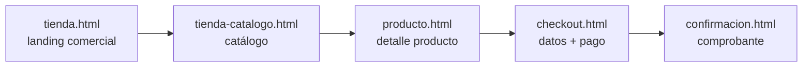

### 1.2 Carta digital (QR en mesa)

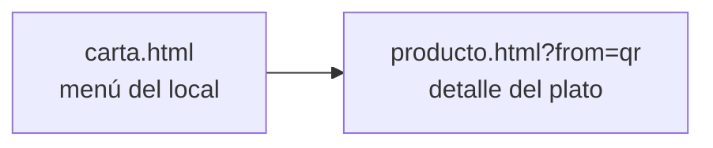

---

## 2. Autenticación — transversal a todos los empleados

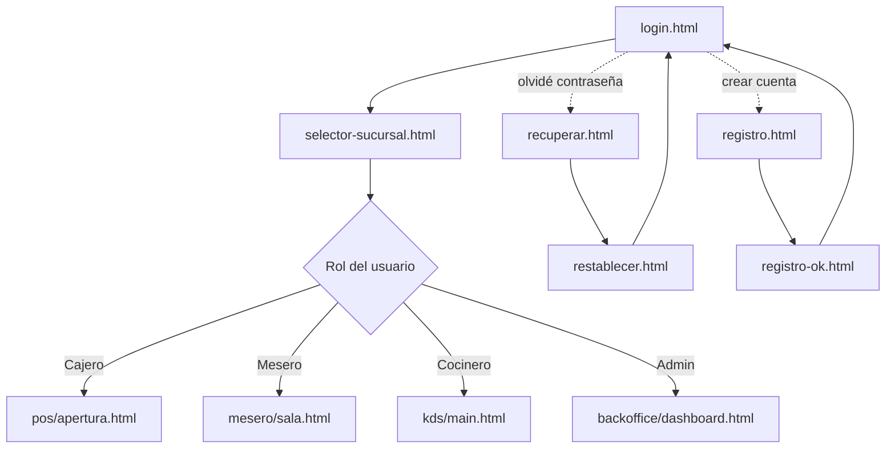

---

## 3. Cajero — POS Web

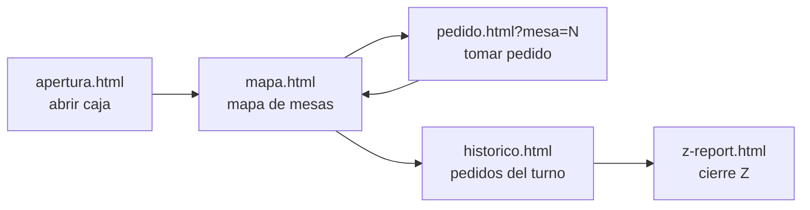

---

## 4. Mesero — App móvil

### 4.1 Flujo principal (tomar y cobrar pedido)

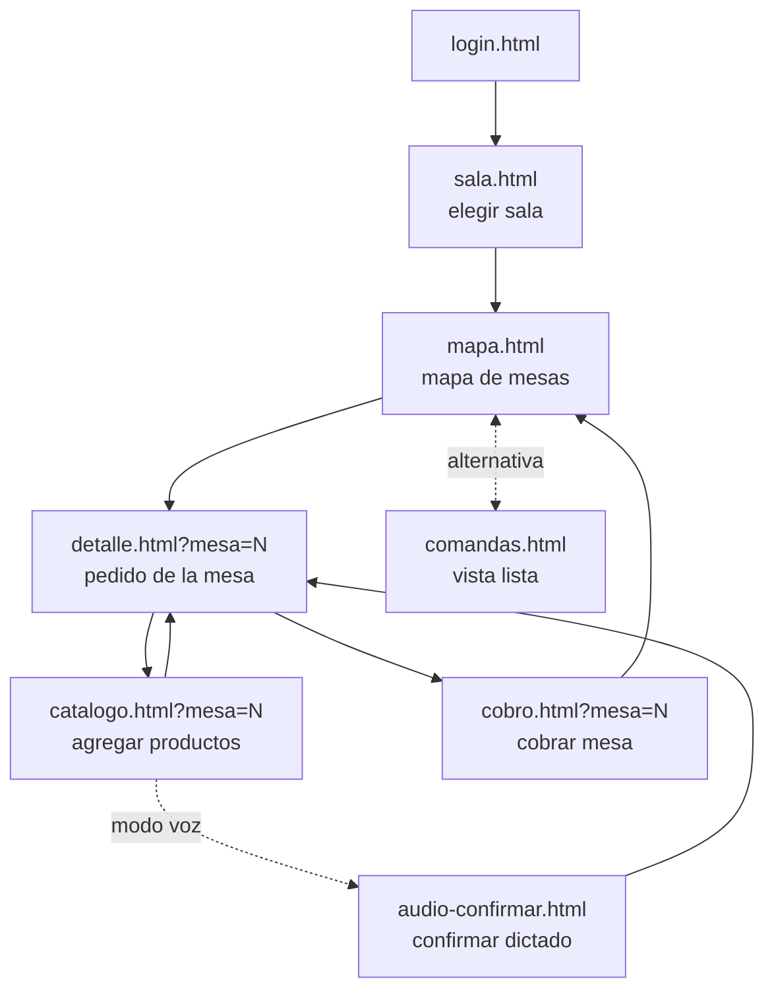

### 4.2 Gestión personal del mesero

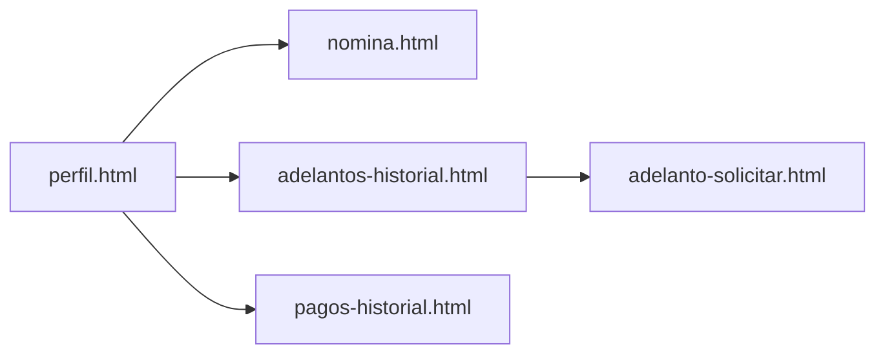

---

## 5. Cocinero — KDS

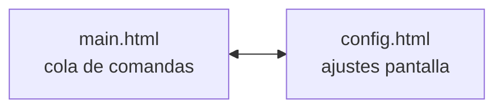

---

## 6. Administrador / Dueño — Backoffice

> El backoffice no es lineal: el sidebar (`_layout.html`) da acceso paralelo a 8 áreas. Cada área tiene su flujo interno.

### 6.1 Mapa general del sidebar

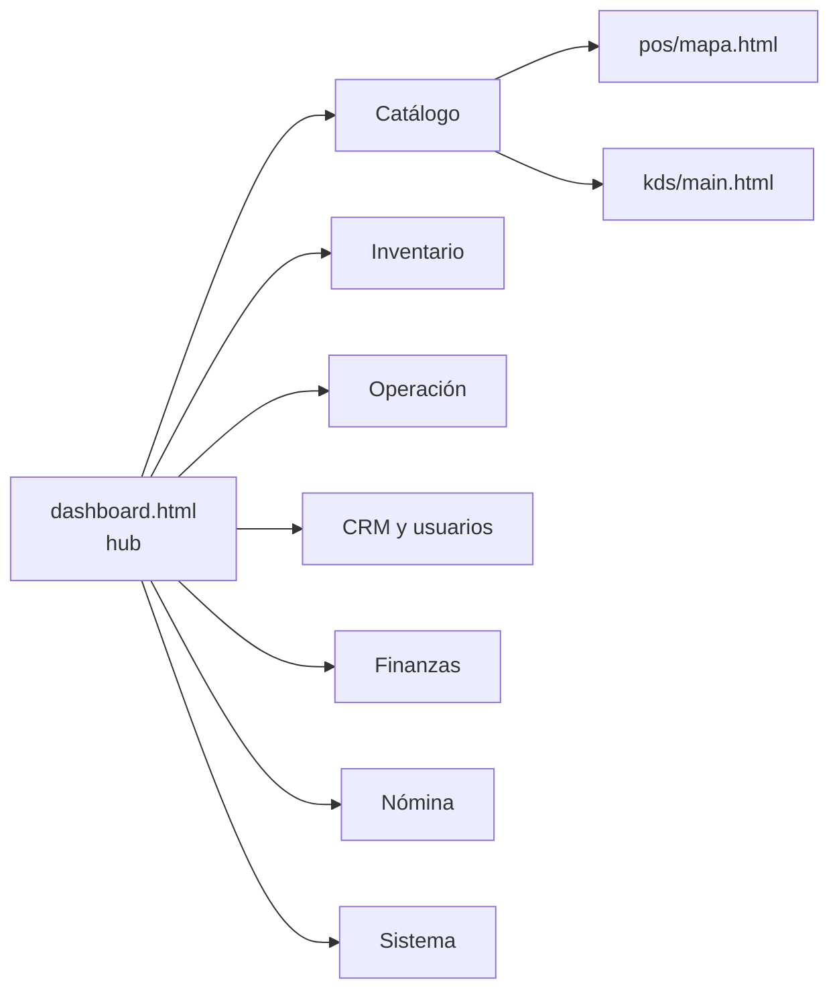

### 6.2 Catálogo de productos

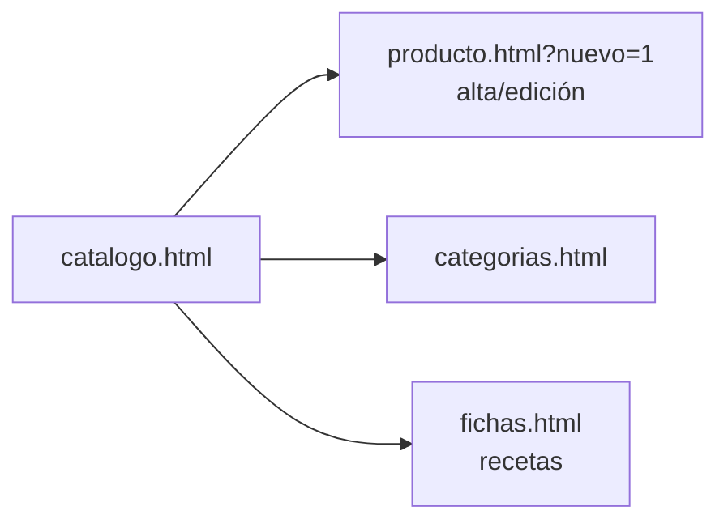

### 6.3 Inventario y proveedores

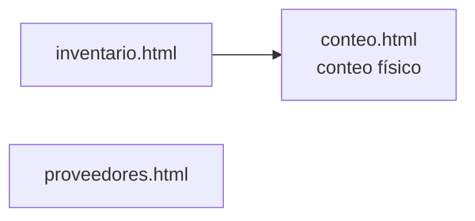

### 6.4 Operación diaria

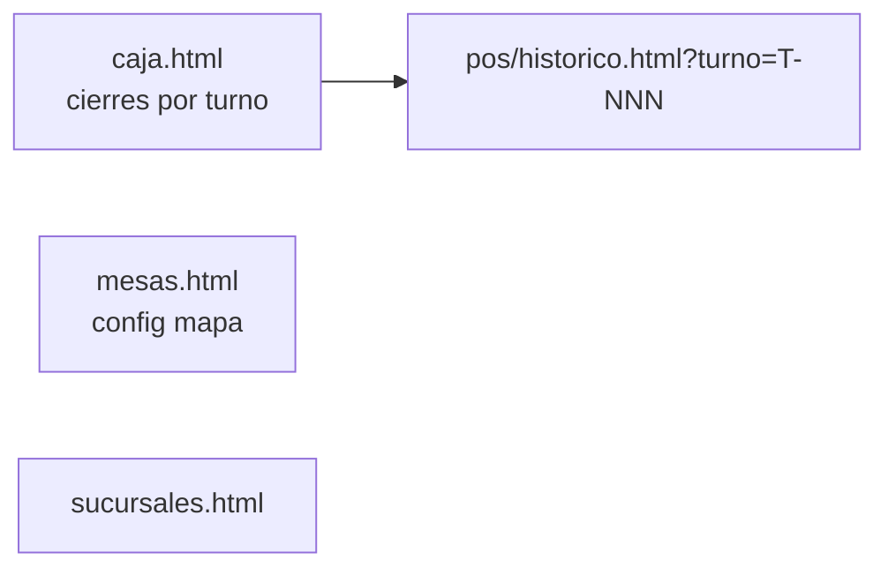

### 6.5 CRM y usuarios

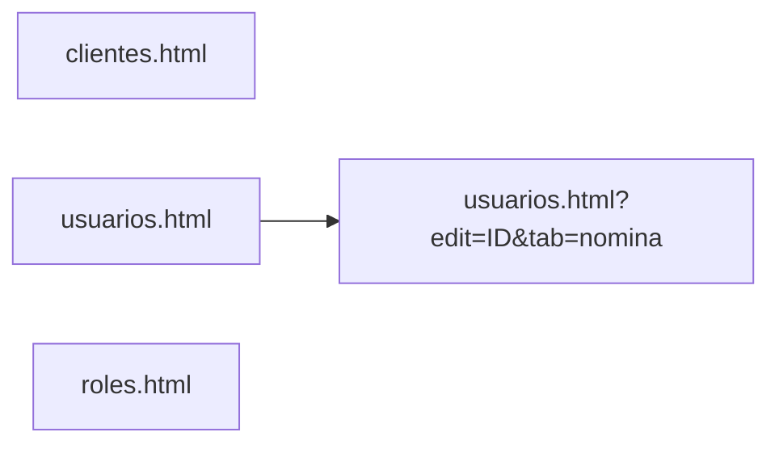

### 6.6 Finanzas y contabilidad

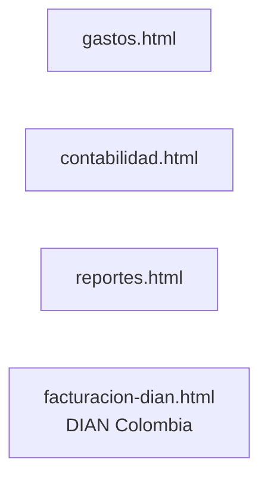

### 6.7 Nómina y adelantos

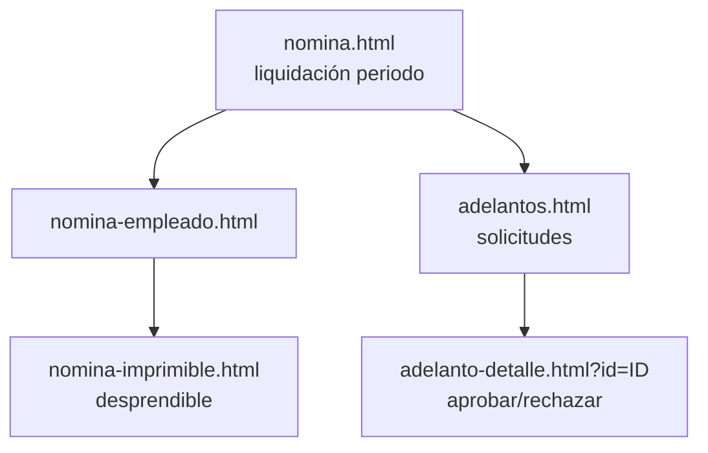

### 6.8 Sistema

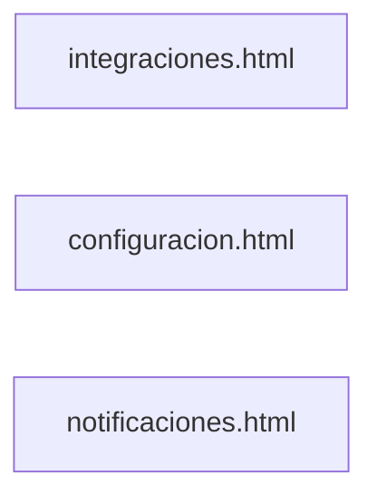

---

## Vista global — todos los roles juntos

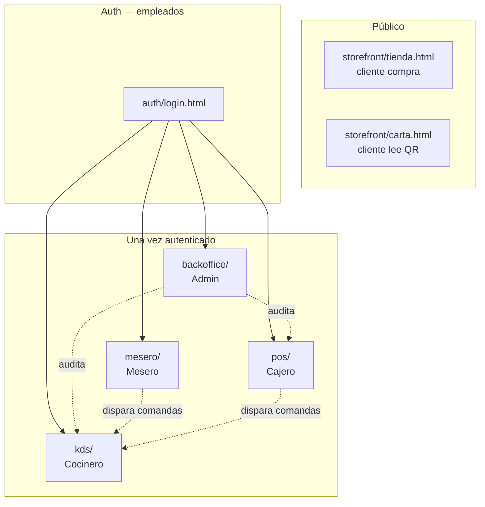
