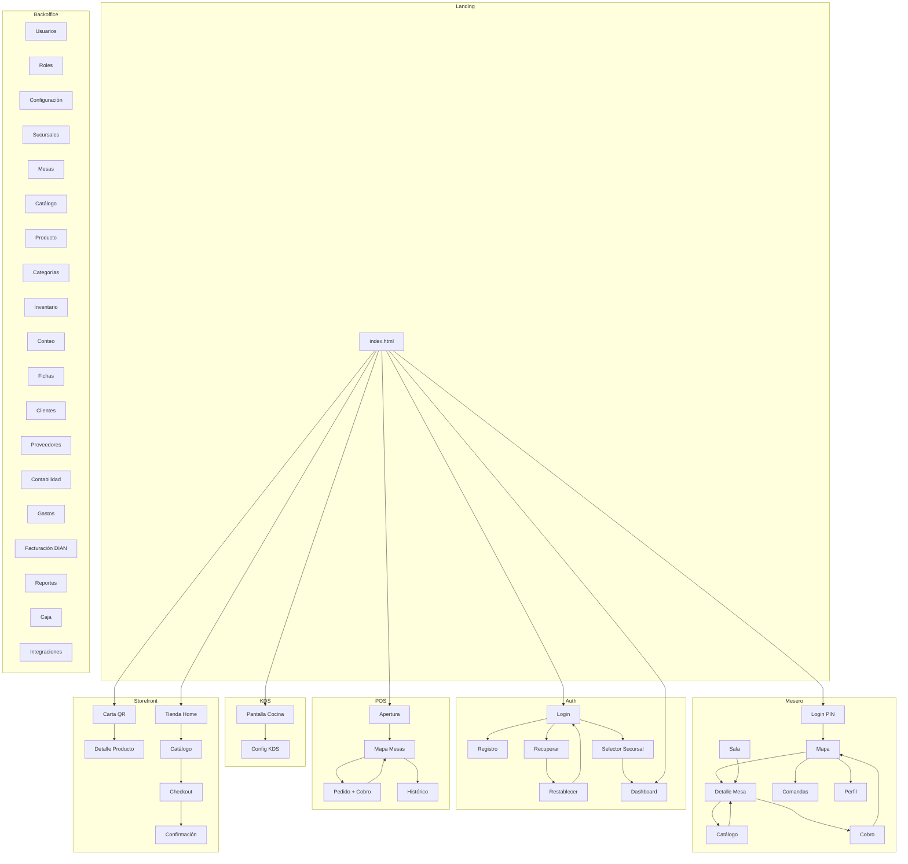

# Auditoría de Pantallas — Inventario POS Demo

> **Fecha:** 14 mayo 2026
> **Estado:** análisis completo de las pantallas implementadas vs. las definidas en el design system.

---

## Resumen ejecutivo

| Métrica                     | Cantidad |
|-----------------------------|----------|
| **Pantallas definidas en DS** | 46       |
| **Archivos HTML creados**     | 48       |
| **Pantallas completas**       | 46       |
| **Pantallas extra (sin JSX DS)** | 2    |
| **Pantallas faltantes del DS**   | 0    |
| **Modales/overlays integrados** | ~15    |

> [!NOTE]
> Todas las pantallas especificadas en el design system (`design-system/`) están implementadas.
> Las 2 pantallas extra (`proveedores.html` y `contabilidad.html`) no tienen archivo JSX dedicado en el DS pero están construidas y funcionales dentro del backoffice.

---

## Inventario completo por módulo

### 1. Landing (`/`)

| # | Pantalla | Archivo | Estado | Sprint |
|---|----------|---------|--------|--------|
| — | Index / Hub de módulos | [index.html](file:///Users/brandonmoreno/Documents/front-demo/index.html) | ✅ Completa | 0 |
| — | Test Design System | [test-ds.html](file:///Users/brandonmoreno/Documents/front-demo/test-ds.html) | ✅ Completa | 0 |

---

### 2. Auth (5 pantallas — Sprint 1)

| Código | Pantalla | Archivo | JSX Referencia | Estado |
|--------|----------|---------|----------------|--------|
| A1 | Login | [login.html](file:///Users/brandonmoreno/Documents/front-demo/auth/login.html) | `auth-a1-login.jsx` | ✅ |
| A2 | Registro | [registro.html](file:///Users/brandonmoreno/Documents/front-demo/auth/registro.html) | `auth-a2-registro.jsx` | ✅ |
| A3 | Recuperar contraseña | [recuperar.html](file:///Users/brandonmoreno/Documents/front-demo/auth/recuperar.html) | `auth-a3-recuperar.jsx` | ✅ |
| A4 | Restablecer contraseña | [restablecer.html](file:///Users/brandonmoreno/Documents/front-demo/auth/restablecer.html) | `auth-a4-restablecer.jsx` | ✅ |
| A5 | Selector de sucursal | [selector-sucursal.html](file:///Users/brandonmoreno/Documents/front-demo/auth/selector-sucursal.html) | `auth-a5-selector.jsx` | ✅ |

---

### 3. Backoffice (20 archivos HTML — Sprints 2–5)

| Código | Pantalla | Archivo | JSX Referencia | Sprint | Estado |
|--------|----------|---------|----------------|--------|--------|
| — | Layout (plantilla) | [_layout.html](file:///Users/brandonmoreno/Documents/front-demo/backoffice/_layout.html) | `bo-shared.jsx` | 0 | ✅ |
| B1 | Dashboard | [dashboard.html](file:///Users/brandonmoreno/Documents/front-demo/backoffice/dashboard.html) | `bo-b1-dashboard.jsx` | 2 | ✅ |
| B2 | Usuarios | [usuarios.html](file:///Users/brandonmoreno/Documents/front-demo/backoffice/usuarios.html) | `bo-b2-usuarios.jsx` | 3 | ✅ |
| B3 | Drawer crear usuario | *(integrado en usuarios.html)* | `bo-b3-drawer-usuario.jsx` | 3 | ✅ |
| B4 | Roles y permisos | [roles.html](file:///Users/brandonmoreno/Documents/front-demo/backoffice/roles.html) | `bo-b4-roles.jsx` | 3 | ✅ |
| B5 | Configuración general | [configuracion.html](file:///Users/brandonmoreno/Documents/front-demo/backoffice/configuracion.html) | `bo-b5-config-general.jsx` | 3 | ✅ |
| B6 | Sucursales | [sucursales.html](file:///Users/brandonmoreno/Documents/front-demo/backoffice/sucursales.html) | `bo-b6-config-sucursales.jsx` | 3 | ✅ |
| B7 | Mesas | [mesas.html](file:///Users/brandonmoreno/Documents/front-demo/backoffice/mesas.html) | `bo-b7-config-mesas.jsx` | 3 | ✅ |
| B8 | Catálogo | [catalogo.html](file:///Users/brandonmoreno/Documents/front-demo/backoffice/catalogo.html) | `bo-b8-catalogo.jsx` | 2 | ✅ |
| B9 | Producto (crear/editar) | [producto.html](file:///Users/brandonmoreno/Documents/front-demo/backoffice/producto.html) | `bo-b9-producto.jsx` | 2 | ✅ |
| B10 | Categorías | [categorias.html](file:///Users/brandonmoreno/Documents/front-demo/backoffice/categorias.html) | `bo-b10-categorias.jsx` | 4 | ✅ |
| B11 | Inventario | [inventario.html](file:///Users/brandonmoreno/Documents/front-demo/backoffice/inventario.html) | `bo-b11-inventario.jsx` | 2 | ✅ |
| B12 | Conteo de inventario | [conteo.html](file:///Users/brandonmoreno/Documents/front-demo/backoffice/conteo.html) | `bo-b12-conteo.jsx` | 4 | ✅ |
| B13 | Fichas técnicas | [fichas.html](file:///Users/brandonmoreno/Documents/front-demo/backoffice/fichas.html) | `bo-b13-fichas.jsx` | 4 | ✅ |
| B14 | Clientes | [clientes.html](file:///Users/brandonmoreno/Documents/front-demo/backoffice/clientes.html) | `bo-b14-clientes.jsx` | 4 | ✅ |
| — | Proveedores | [proveedores.html](file:///Users/brandonmoreno/Documents/front-demo/backoffice/proveedores.html) | ⚠️ Sin JSX dedicado | extra | ✅ Extra |
| B16 | Gastos | [gastos.html](file:///Users/brandonmoreno/Documents/front-demo/backoffice/gastos.html) | `bo-b16-gastos.jsx` | 5 | ✅ |
| B17 | Facturación DIAN | [facturacion-dian.html](file:///Users/brandonmoreno/Documents/front-demo/backoffice/facturacion-dian.html) | `bo-b17-dian.jsx` | 5 | ✅ |
| B18 | Reportes | [reportes.html](file:///Users/brandonmoreno/Documents/front-demo/backoffice/reportes.html) | `bo-b18-reportes.jsx` | 5 | ✅ |
| — | Contabilidad | [contabilidad.html](file:///Users/brandonmoreno/Documents/front-demo/backoffice/contabilidad.html) | ⚠️ Sin JSX dedicado | extra | ✅ Extra |
| B20 | Caja | [caja.html](file:///Users/brandonmoreno/Documents/front-demo/backoffice/caja.html) | `bo-b20-caja.jsx` | 5 | ✅ |
| B22 | Integraciones | [integraciones.html](file:///Users/brandonmoreno/Documents/front-demo/backoffice/integraciones.html) | `bo-b22-integraciones.jsx` | 5 | ✅ |

> [!IMPORTANT]
> **Proveedores** y **Contabilidad** fueron implementadas como pantallas adicionales del backoffice. No tienen un archivo `.jsx` en el design system, pero existen como HTML funcionales y están registradas en el sidebar de navegación.

---

### 4. POS Web (4 archivos + 1 modal — Sprint 6)

| Código | Pantalla | Archivo | JSX Referencia | Estado |
|--------|----------|---------|----------------|--------|
| — | Layout (plantilla) | [_layout.html](file:///Users/brandonmoreno/Documents/front-demo/pos/_layout.html) | `pos-shared.jsx` | ✅ |
| C1 | Apertura de turno | [apertura.html](file:///Users/brandonmoreno/Documents/front-demo/pos/apertura.html) | `pos-c1-apertura.jsx` | ✅ |
| C2 | Mapa de mesas | [mapa.html](file:///Users/brandonmoreno/Documents/front-demo/pos/mapa.html) | `pos-c2-mapa.jsx` | ✅ |
| C3 | Toma de pedido | [pedido.html](file:///Users/brandonmoreno/Documents/front-demo/pos/pedido.html) | `pos-c3-pedido.jsx` | ✅ |
| C4 | Modal de cobro | *(integrado en pedido.html)* | `pos-c4-cobro.jsx` | ✅ |
| C5 | Histórico | [historico.html](file:///Users/brandonmoreno/Documents/front-demo/pos/historico.html) | `pos-c5-historico.jsx` | ✅ |

> [!NOTE]
> C4 (Cobro) se implementa como modal dentro de `pedido.html`, no como archivo separado. Esto es correcto según la especificación del Sprint 6.

---

### 5. App Mesero (9 pantallas — Sprint 7)

| Código | Pantalla | Archivo | JSX Referencia | Estado |
|--------|----------|---------|----------------|--------|
| — | Layout (frame iPhone) | [_layout.html](file:///Users/brandonmoreno/Documents/front-demo/mesero/_layout.html) | `mesero-shared.jsx` | ✅ |
| E1 | Login PIN | [login.html](file:///Users/brandonmoreno/Documents/front-demo/mesero/login.html) | `mesero-e1-login.jsx` | ✅ |
| E2 | Sala (lista) | [sala.html](file:///Users/brandonmoreno/Documents/front-demo/mesero/sala.html) | `mesero-e2-sala.jsx` | ✅ |
| E3 | Mapa de mesas | [mapa.html](file:///Users/brandonmoreno/Documents/front-demo/mesero/mapa.html) | `mesero-e3-mapa.jsx` | ✅ |
| E4 | Detalle mesa | [detalle.html](file:///Users/brandonmoreno/Documents/front-demo/mesero/detalle.html) | `mesero-e4-detalle.jsx` | ✅ |
| E5 | Catálogo | [catalogo.html](file:///Users/brandonmoreno/Documents/front-demo/mesero/catalogo.html) | `mesero-e5-catalogo.jsx` | ✅ |
| E6 | Bottom-sheet modificadores | *(integrado en catalogo.html)* | `mesero-e6-bottomsheet.jsx` | ✅ |
| E7 | Comandas activas | [comandas.html](file:///Users/brandonmoreno/Documents/front-demo/mesero/comandas.html) | `mesero-e7-comandas.jsx` | ✅ |
| E8 | Cobro rápido | [cobro.html](file:///Users/brandonmoreno/Documents/front-demo/mesero/cobro.html) | `mesero-e8-cobro.jsx` | ✅ |
| E9 | Perfil | [perfil.html](file:///Users/brandonmoreno/Documents/front-demo/mesero/perfil.html) | `mesero-e9-perfil.jsx` | ✅ |

---

### 6. KDS (2 pantallas — Sprint 8)

| Código | Pantalla | Archivo | JSX Referencia | Estado |
|--------|----------|---------|----------------|--------|
| D1 | Pantalla cocina | [main.html](file:///Users/brandonmoreno/Documents/front-demo/kds/main.html) | `kds-d1-main.jsx` | ✅ |
| D2 | Configuración | [config.html](file:///Users/brandonmoreno/Documents/front-demo/kds/config.html) | `kds-d2-config.jsx` | ✅ |

---

### 7. Storefront (6 pantallas — Sprint 9)

| Código | Pantalla | Archivo | JSX Referencia | Estado |
|--------|----------|---------|----------------|--------|
| F1 | Carta QR (mobile) | [carta.html](file:///Users/brandonmoreno/Documents/front-demo/storefront/carta.html) | `sf-f1-carta-qr.jsx` | ✅ |
| F2 | Detalle producto (mobile) | [producto.html](file:///Users/brandonmoreno/Documents/front-demo/storefront/producto.html) | `sf-f2-detalle-producto.jsx` | ✅ |
| F3 | Tienda home (desktop) | [tienda.html](file:///Users/brandonmoreno/Documents/front-demo/storefront/tienda.html) | `sf-f3-tienda-home.jsx` | ✅ |
| F4 | Tienda catálogo (desktop) | [tienda-catalogo.html](file:///Users/brandonmoreno/Documents/front-demo/storefront/tienda-catalogo.html) | `sf-f4-tienda-catalogo.jsx` | ✅ |
| F5 | Checkout (desktop) | [checkout.html](file:///Users/brandonmoreno/Documents/front-demo/storefront/checkout.html) | `sf-f5-checkout.jsx` | ✅ |
| F6 | Confirmación | [confirmacion.html](file:///Users/brandonmoreno/Documents/front-demo/storefront/confirmacion.html) | `sf-f6-confirmacion.jsx` | ✅ |

---

## Mapa de navegación

---

## Modales y overlays integrados

Estos componentes no son archivos HTML independientes sino que están embebidos dentro de las pantallas:

| Overlay | Tipo | Dentro de | Funcional |
|---------|------|-----------|-----------|
| Drawer crear usuario (B3) | Drawer | `usuarios.html` | ✅ |
| Modal nueva categoría | Modal | `categorias.html` | ✅ |
| Drawer agregar ingrediente | Drawer | `fichas.html` | ✅ |
| Drawer detalle cliente | Drawer + tabs | `clientes.html` | ✅ |
| Modal nuevo gasto | Modal | `gastos.html` | ✅ |
| Modal confirmar conteo | Modal | `conteo.html` | ✅ |
| Modal generar reporte | Modal | `reportes.html` | ✅ |
| Drawer integraciones | Drawer | `integraciones.html` | ✅ |
| Modal modificadores (POS) | Modal | `pedido.html` | ✅ |
| Modal cobro (C4) | Modal | `pedido.html` | ✅ |
| Modal detalle ticket | Modal | `historico.html` | ✅ |
| Bottom-sheet modifs (E6) | Bottom-sheet | `catalogo.html` (mesero) | ✅ |
| Modal Ctrl+K / Cmd+K | Modal | Todas (via `nav.js`) | ✅ |
| Modal cerrar turno | Modal | `mapa.html` (POS) | ✅ |

---

## Archivos CSS y JS del sistema

### CSS

| Archivo | Propósito | Tamaño |
|---------|-----------|--------|
| `tokens.css` | Variables CSS (colores, tipografía, espaciado) | 3.4 KB |
| `components.css` | Botones, inputs, badges, cards, tablas, overlays | 45.8 KB |
| `shells.css` | Sidebar/topbar backoffice | 31.5 KB |
| `utilities.css` | Focus, skip-link, skeleton, reduced-motion | 4.4 KB |
| `auth.css` | Shell auth (split panel, centrado) | 19.1 KB |
| `pos-shell.css` | Shell POS (topbar, contenido, bottombar) | 49.7 KB |
| `mesero.css` | Shell mesero (frame iPhone, bottom-tab) | 15.7 KB |
| `kds.css` | Shell KDS (dark default, tickets, grid) | 13.4 KB |
| `storefront.css` | Shell storefront (mobile + desktop) | 57.5 KB |

### JS

| Archivo | Propósito | Tamaño |
|---------|-----------|--------|
| `theme.js` | Toggle dark/light, persistencia localStorage | 2.9 KB |
| `ui.js` | Modales, drawers, bottom-sheets, toasts, tabs | 11.2 KB |
| `nav.js` | Botón home flotante + modal Ctrl+K (48 páginas) | 12.1 KB |
| `storefront.js` | Carrito storefront, interacciones carta/tienda | 5.3 KB |

---

## Pantallas extra (sin JSX en el DS)

Estas pantallas fueron implementadas como parte del backoffice pero **no tienen un archivo `.jsx` dedicado** en `design-system/backoffice/`:

### 1. Proveedores (`backoffice/proveedores.html`)

- **Tamaño:** 36.9 KB
- **Sidebar:** Registrada y visible en la navegación
- **Nav.js:** Registrada como "Proveedores" en el array PAGES
- **Observación:** Mencionada en el sidebar del `bo-shared.jsx` pero sin pantalla JSX propia

### 2. Contabilidad (`backoffice/contabilidad.html`)

- **Tamaño:** 56.8 KB (la pantalla más grande del backoffice)
- **Sidebar:** Registrada y visible en la navegación
- **Nav.js:** Registrada como "Contabilidad" en el array PAGES
- **Observación:** Mencionada en el sidebar del `bo-shared.jsx` pero sin pantalla JSX propia

---

## Conclusión

> [!TIP]
> **No hay pantallas faltantes.** Todas las 46 pantallas del design system están implementadas como archivos HTML funcionales. Adicionalmente se crearon 2 pantallas extra (Proveedores y Contabilidad) que complementan el backoffice aunque no tengan referencia JSX dedicada.

### Conteo final

| Módulo | DS JSX | HTML Implementados | Extras | Estado |
|--------|--------|--------------------|--------|--------|
| Auth | 5 | 5 | 0 | ✅ 100% |
| Backoffice | 18 | 20 | 2 | ✅ 100%+ |
| POS | 5 (incl. modal) | 4 + 1 modal | 0 | ✅ 100% |
| Mesero | 9 (incl. bottom-sheet) | 8 + 1 sheet | 0 | ✅ 100% |
| KDS | 2 | 2 | 0 | ✅ 100% |
| Storefront | 6 | 6 | 0 | ✅ 100% |
| **Total** | **~46** | **48** | **2** | **✅ Completo** |
